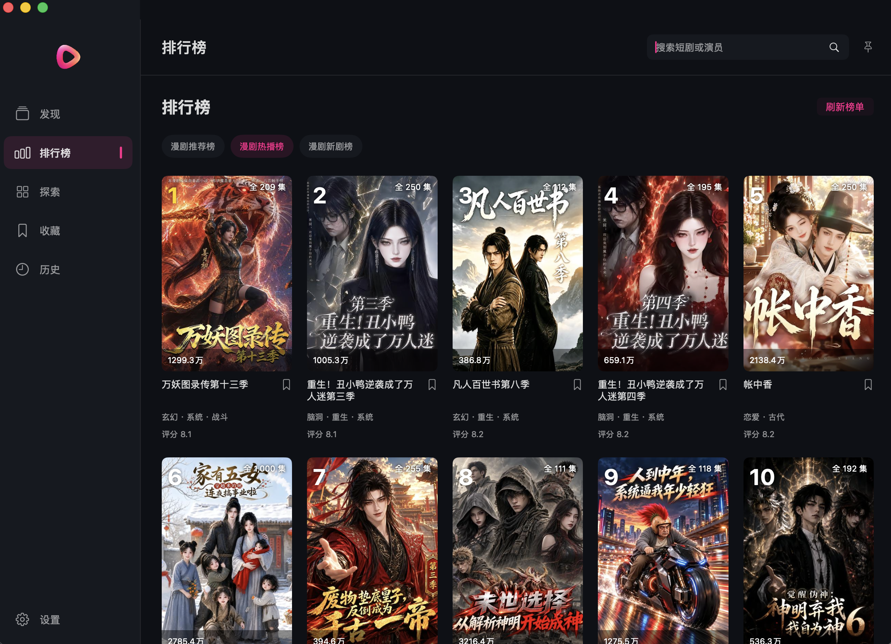

<p align="center">
  
</p>

<h1 align="center">红果短剧</h1>

<p align="center">Mac 上点进就播，下次回来接着看。</p>

[](https://github.com/JialaoLiu/hongguo-mac-release/releases/latest)
[](https://github.com/JialaoLiu/hongguo-mac-release/releases/latest)

## 为什么做这个

起因很简单：我先看到了 [waligoraamodio288-rgb 的红果桌面版](https://github.com/waligoraamodio288-rgb/hongguo-desktop-releases)。作为一个摸鱼党，也想在 Mac 上用，但当时没找到能直接拿来用的 Mac 版本。

那就自己 vibe 一个。先做给自己用，也放出来给大家一起用。

**不用手机 App，不用另装 Java、FFmpeg 或 Homebrew。** 找剧、选集、续播、看评论，在一个桌面窗口里完成。

[下载安装包](https://github.com/JialaoLiu/hongguo-mac-release/releases/latest) · [反馈问题](https://github.com/JialaoLiu/hongguo-mac-release/issues) · [使用许可](LICENSE) · [项目声明](#项目声明)

## 一条命令，装好就看

支持 **Apple Silicon（M 系列）和 macOS 26 及以上**。打开终端，粘贴这条命令：

```bash
curl -fsSL https://raw.githubusercontent.com/JialaoLiu/hongguo-mac-release/main/install.sh | bash
```

自动下载最新版、安装到 Applications、检查签名完整性。装好后打开 **红果短剧** 即可；无需单独下载运行组件 ZIP。运行前可先查看 [脚本内容](install.sh)。也可以在 [Releases](https://github.com/JialaoLiu/hongguo-mac-release/releases/latest) 下载 `install.sh`，在终端执行 `bash ~/Downloads/install.sh`。

**Discover · 深色模式**


## 看剧顺手，找剧省事

| 想做什么 | 直接怎么用 |
| --- | --- |
| 找一部剧 | 搜索剧名或演员，切换真人剧、漫剧、AI 剧 |
| 不知道看什么 | 看热播榜、刷发现页，探索里按主题筛选 |
| 接着上次看 | 点进剧集就续播；没看过的从第一集开始 |
| 找下一季 | 在相关作品里直接切换同系列其他季 |
| 边做事边看 | 开画中画，或切换视频全屏 |
| 调整播放 | 选画质、调倍速、拖进度；全屏左侧调亮度，右侧调音量 |
| 看大家怎么说 | 读评论、看点赞数、展开楼中楼；下滑自动加载 |
| 留着以后看 | 收藏和观看记录保存在本机 |
| 换个外观 | 默认深色，也支持浅色和跟随系统 |
| 更新软件 | 设置里检查更新，下载完成后自动替换并重启 |

排行榜与探索下滑自动追加，不用反复点“加载更多”。左上角 Logo 一点，就回首页。

## 更多界面

**Ranking · 深色模式**



**Explore · 浅色模式**


## 想手动安装？

在 [Releases](https://github.com/JialaoLiu/hongguo-mac-release/releases/latest) 下载最新的 `HongguoDrama-<版本>-arm64.dmg`，打开后把 **红果短剧.app** 拖到右侧 **Applications**。

<details>
<summary>手动安装后的首次打开提示，以及指定版本安装</summary>

当前安装包使用 ad hoc 签名，尚未完成 Apple Developer ID 签名与公证。手动下载后若提示“Apple 无法验证此应用是否安全”：

1. 将应用拖到 Applications，尝试打开一次，关闭提示。
2. 打开“系统设置 → 隐私与安全性”。
3. 找到红果短剧，选择“仍要打开”。

macOS 15 及以后，右键“打开”已不能绕过这个提示。[Apple 官方步骤](https://support.apple.com/zh-cn/guide/mac-help/mh40616/mac)

确认来源可信后，也可以在终端运行：

```bash
xattr -dr com.apple.quarantine "/Applications/红果短剧.app"
```

一键安装脚本已包含清除该应用下载隔离属性的步骤。这不代表应用已获 Apple 公证。

安装指定版本：

```bash
curl -fsSL https://raw.githubusercontent.com/JialaoLiu/hongguo-mac-release/main/install.sh | HONGGUO_VERSION=0.4.1 bash
```

</details>

## 致谢与参考

感谢以下项目及其维护者公开的代码、技术资料和产品经验，为本项目的开发提供了帮助。

| 项目 | 参考或使用范围 |
| --- | --- |
| [hongguo-desktop-releases](https://github.com/waligoraamodio288-rgb/hongguo-desktop-releases) | 桌面播放流程、功能与 Issues 的参考；签名运行资料取自其 v1.0.4 发行包 |
| [zhangbaio/hongguo](https://github.com/zhangbaio/hongguo) | 内容接口与媒体处理链路的研究资料，以及 FqTrace / unidbg-sign 运行组件 |
| [KEJIYUNB/hongguo](https://github.com/KEJIYUNB/hongguo) | Android 端交互与体验优化资料参考 |
| [fanqie-assistant](https://github.com/naiyQAQ/fanqie-assistant) | 评论、回复与楼中楼接口的协议字段参考 |
| [unidbg](https://github.com/zhkl0228/unidbg) | 本机签名组件所需的 native 执行框架 |
| [OpenJDK 17](https://openjdk.org/projects/jdk/17/) | 随包 Java 运行环境 |
| [FFmpeg](https://ffmpeg.org/) | 媒体读取、处理与 MP4 重封装 |

macOS 界面、导航、播放器交互和本机数据管理由本项目独立实现。参考资料、直接使用的组件及其原有许可分别保留，详见下方项目声明和安装包内的组件声明。

## 项目声明

**非官方客户端，面向个人学习、研究和非商业技术交流。采用新非商业许可的自有材料请勿商用；第三方内容与组件的权利归各自权利方所有。**

<details>
<summary>项目关系、许可、版权归属、第三方来源与权利反馈</summary>

本仓库是“红果短剧”独立 macOS 桌面客户端的发行与问题反馈仓库，保存说明文件和编译安装附件。应用源码保留在本地；仓库公开不代表应用完整源码已公开。

### 项目关系

本项目由独立开发者维护，与红果平台及其运营主体没有隶属、合作、授权或背书关系，也不是平台官方 macOS 客户端。“红果短剧”名称用于说明客户端所连接的平台，相关名称与商标归各自权利人所有。

本项目的 Swift 界面、导航、播放器交互和本机数据管理独立编写，不是 `waligoraamodio288-rgb/hongguo-desktop-releases` 的 Mac 移植版、维护分支或关联产品。使用的第三方运行组件及取得途径仍如实保留在 下方第三方组件说明 和安装包内的声明中。

### 许可与内容归属

本项目面向个人学习、研究和非商业技术交流。新发布且明确采用 [非商业使用许可](LICENSE) 的自有材料请勿商用；商业使用需另行取得权利人的书面许可。

第三方组件保持原有许可，平台名称、商标、视频、封面、评论等权利归各自权利方所有。本项目的使用许可不授予第三方材料的使用及再分发权。

v0.4.2 及此前已发布的安装包和此前按 MIT 取得的材料继续遵循原有许可；本次更新不追溯取消已授予的 MIT 权利。后续采用新许可的应用安装包须随包提供新许可。

仓库不存储或发布剧集媒体库。客户端使用中展示的内容来自对应内容服务，内容权利属于其各自权利人；可用范围及使用条件由内容服务决定。应用的运行组件和相关许可声明随安装包提供。

应用图标参考公开播放三角环的形状，重新生成黑灰圆角底板上的玫红至珊瑚渐变图形，不使用官方文字或完整应用图标。侧栏使用同色透明底三角环。这些视觉设计不表示获得平台授权。

### 权利反馈

如认为仓库中的具体文件或发行附件侵犯您的权利，请在 [Issues](https://github.com/JialaoLiu/hongguo-mac-release/issues) 提供相关文件或附件链接、权利归属说明、具体理由及可联系的方式。维护者会核查并对有依据的问题进行修改或移除；涉及个人隐私的信息请勿公开提交。

### 第三方组件与资料来源

| 组件 | 来源 | 用途 |
| --- | --- | --- |
| FqTrace / unidbg-sign | https://github.com/zhangbaio/hongguo/tree/main/unidbg-sign | 本机请求签名 |
| unidbg 与 JNI 依赖 | https://github.com/zhkl0228/unidbg | 执行签名组件所需的 native 代码 |
| OpenJDK 17 | https://openjdk.org/projects/jdk/17/ | 随包 Java 运行环境 |
| FFmpeg 与编解码库 | https://ffmpeg.org/ | CENC 媒体读取和 MP4 重封装 |

原始组件声明保存在应用的 `Contents/Resources/NativeRuntime/notices`，源码引用和构建步骤保存在本项目。Swift 界面、请求集成和本机启动器由本项目实现。

签名所需的运行资料取自 [hongguo-desktop-releases v1.0.4](https://github.com/waligoraamodio288-rgb/hongguo-desktop-releases/releases/tag/v1.0.4) 发行包。原始 Python 后端没有并入本项目。组件来源声明不代表双方存在合作或维护关系。

评论与楼中楼的协议字段参考 [fanqie-assistant/src/api/comment.ts](https://github.com/naiyQAQ/fanqie-assistant/blob/main/src/api/comment.ts)，采用独立 Swift 实现，仅接入读取接口。

应用图标根据用户提供的公开播放三角环参考，通过 imagegen 重新生成黑灰圆角底板上的玫红至珊瑚渐变图形，保存为 `packaging/AppIcon.png`；未使用完整官方应用图标或其文字。参考形状涉及的第三方权利仍归其权利人，图标改色不表示平台授权。左上角使用无底板的透明三角环，资源为 `packaging/DesktopLogo.png`。本客户端为独立桌面项目。

DMG 安装布局使用 [dmgbuild](https://github.com/dmgbuild/dmgbuild)、[ds_store](https://github.com/dmgbuild/ds_store) 与 [mac_alias](https://github.com/dmgbuild/mac_alias) 生成 Finder 配置；这些仅为本地打包工具，不是应用运行依赖。

</details>

## 用着顺手，欢迎点个 Star

问题和建议发到 [Issues](https://github.com/JialaoLiu/hongguo-mac-release/issues)。带上应用版本、macOS 版本和截图，方便定位。
