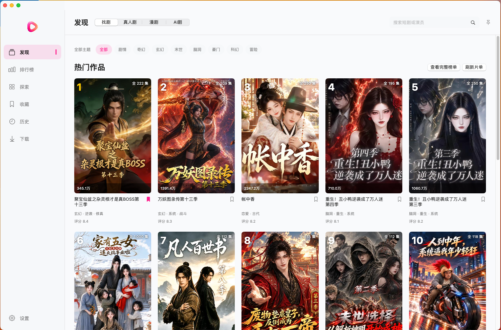
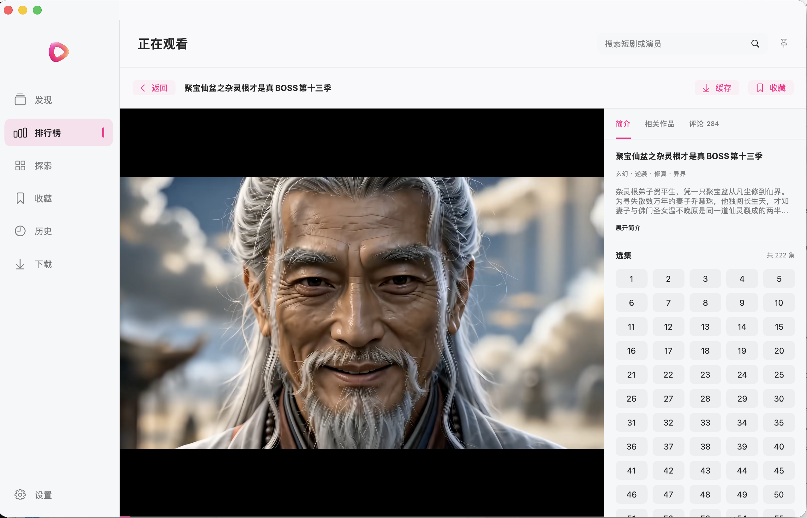
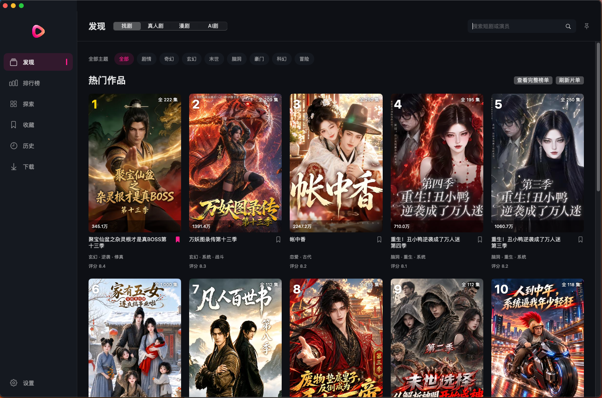
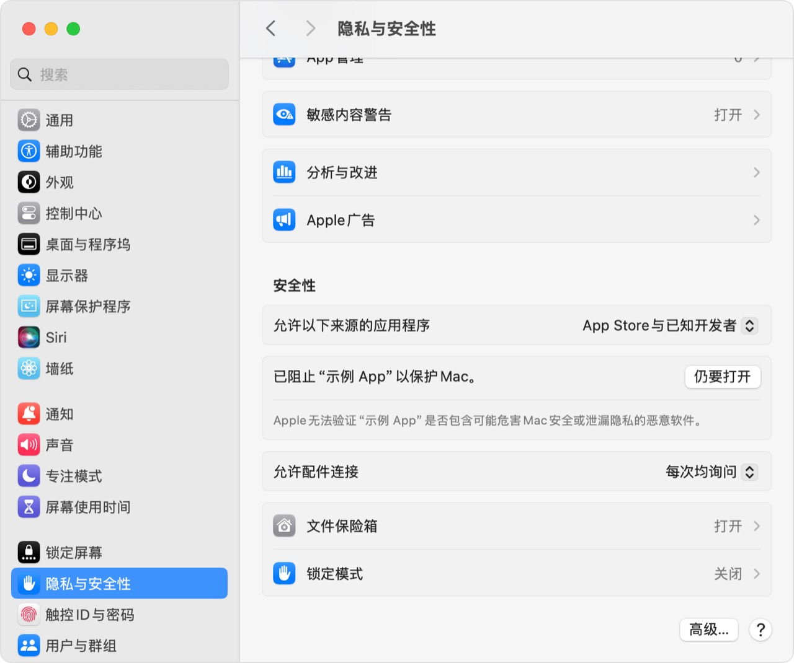
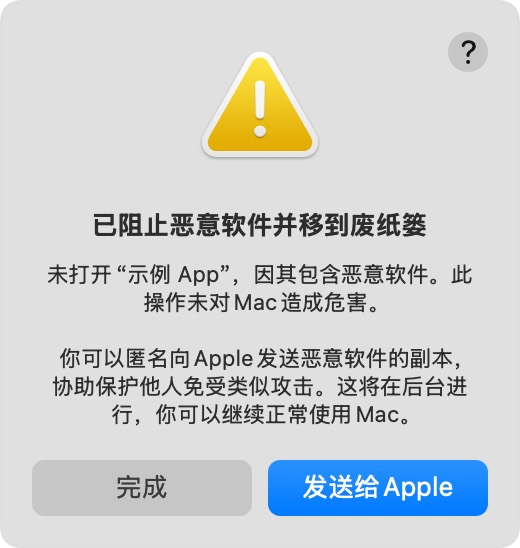

  

<h1 align="center">红果短剧</h1>

Mac 上点进就播，下次回来接着看。

## 为什么做这个

起因很简单：我先看到了 [waligoraamodio288-rgb 的红果桌面版](https://github.com/waligoraamodio288-rgb/hongguo-desktop-releases)。作为一个摸鱼党，也想在 Mac 上用，但当时没找到能直接拿来用的 Mac 版本。

那就自己 vibe 一个。先做给自己用，也放出来给大家一起用。

**不用手机 App，不用另装 Java、FFmpeg 或 Homebrew。** 找剧、选集、续播、看评论，在一个桌面窗口里完成。

**当前版本：0.7.0 · build 20**

[下载安装包](https://github.com/JialaoLiu/hongguo-mac-release/releases/latest) · [反馈问题](https://github.com/JialaoLiu/hongguo-mac-release/issues) · [问题与修复记录](docs/BUGS.md) · [使用许可](LICENSE) · [项目声明](#项目声明)

## 界面预览

**首页 · 浅色**

**正在观看**

## 下载与安装

支持 **Apple Silicon（M 系列）和 macOS 13 及以上**。Intel（x86_64）版仍在适配，尚未提供安装包。

1. 在 [Releases 下载最新版](https://github.com/JialaoLiu/hongguo-mac-release/releases/latest)的 `HongguoDrama-<版本>-arm64.dmg`。
2. 打开 DMG，把 **红果短剧.app** 拖到右侧 **Applications**。
3. 从 Applications 打开红果短剧。首次打开被拦截时，按下方带图步骤操作。

只需下载 DMG，无需单独下载运行组件 ZIP，也不用另装 Java 或 FFmpeg。

## 0.7.0 更新

新增当前集弹幕与 53 种原版表情，优化评论、选集、下载和播放控件。弹幕默认关闭并记住选择；回复原位分页；下载完成后可直接播放。完整改动与验证记录见 [0.7.0 Release](https://github.com/JialaoLiu/hongguo-mac-release/releases/tag/v0.7.0)。

## 看剧顺手，找剧省事

| 想做什么 | 直接怎么用 |
| --- | --- |
| 找一部剧 | 搜索剧名或演员，切换真人剧、漫剧、AI 剧 |
| 不知道看什么 | 看热播榜、刷发现页，探索里按主题筛选 |
| 接着上次看 | 点进剧集就续播；没看过的从第一集开始 |
| 找下一季 | 在相关作品里直接切换同系列其他季 |
| 边做事边看 | 开启画中画小窗，主窗口自动收起；也可以切换视频全屏 |
| 连着看不息屏 | 设置中开启“播放时防止屏幕休眠”，暂停后恢复系统设置 |
| 调整播放 | 选画质、调倍速、拖进度；长按右方向键临时 2 倍速，松开恢复；全屏左侧调亮度，右侧调音量 |
| 看弹幕 | 手动打开后记住选择，默认关闭；可调透明度、速度、行数和字号 |
| 查看快捷键 | 播放页点击问号；M 静音／恢复音量，首次观看会出现简短提示 |
| 临时藏起来 | Command+B 暂停、静音并隐藏窗口，再按一次恢复；不改变系统音量 |
| 看大家怎么说 | 当前集评论与原版表情，回复原位展开、每页 10 条；近期显示几小时前／几天前 |
| 离线追剧 | 播放页缓存选集；下载页点击播放或继续观看，显示进度和速度，可全部下载／暂停或批量删除，全屏也能直接选集 |
| 连着看下一集 | 选集上方开启自动下一集，默认打开；下一集提前缓存，自动缓存约 512 MB |
| 专心看画面 | 简介、相关作品、评论分开展示，右栏可收起，播放控件自动隐藏 |
| 留着以后看 | 收藏和观看记录保存在本机 |
| 换个外观 | 默认跟随系统，也可以选择浅色或深色 |
| 更新软件 | 设置里检查更新，下载完成后自动替换并重启 |

排行榜与探索下滑自动追加，不用反复点“加载更多”。左上角 Logo 一点，就回首页。导航、分类和榜单切换有轻量动效。

在线播放保留左侧菜单，下载播放时自动收起，点“返回”恢复。换集时保留右侧选集区的滚动位置。下载剧集全屏观看时，右下角点“选集”即可展开深灰集数面板，只显示已下载的集数，切集后继续保持全屏。

## 小窗也能接着看

播放器点“画中画”，视频悬浮在其他窗口上方，主窗口自动最小化。暂停、继续播放和自动换集都可以在小窗状态下使用；回到主窗口后接着看。

## 深色外观

默认跟随系统，也可以在设置中随时切换浅色或深色。

## 首次打开被拦截怎么办？

当前安装包使用 ad hoc 签名，尚未完成 Apple Developer ID 签名与公证。请先看提示的具体内容：

| 系统提示 | 怎么处理 |
| --- | --- |
| 无法验证开发者、无法检查是否包含恶意软件 | 确认来自本仓库 Releases 且未被改动后，按下面的“仍要打开”步骤操作 |
| App 已损坏、无法打开 | 先删除本次下载并从本仓库 Releases 重新下载；仍失败时反馈版本、提示原文和截图 |
| 将损坏你的电脑、已阻止恶意软件并移到废纸篓 | 停止运行并反馈，等待核查；不要用下面的命令绕过此类拦截 |

**无法验证开发者或尚未公证：**

1. 将应用拖到 Applications，尝试打开一次，关闭提示。
2. 打开“系统设置 → 隐私与安全性”，向下滚动至“安全性”。
3. 找到红果短剧，选择“仍要打开”，按系统提示确认“打开”。

上图中的“示例 App”是系统说明示例，实际操作时请核对应用名称。[Apple 官方说明](https://support.apple.com/zh-cn/102445)

macOS 15 及以后，右键“打开”已不能绕过这个提示。[Apple 官方步骤](https://support.apple.com/zh-cn/guide/mac-help/mh40616/mac)

**App 将损坏你的电脑或 App 已损坏：**

这张“示例 App”截图用于区分提示类型，并非红果短剧的检测结果。Apple 说明：“将损坏你的电脑”可能涉及恶意内容或授权撤销；“已损坏”可能涉及文件损坏或被修改；检测到已知恶意软件时，系统会阻止打开并将其移到废纸篓。遇到恶意软件拦截请保留提示并在 [Issues](https://github.com/JialaoLiu/hongguo-mac-release/issues) 反馈，不要强行打开。[Apple 官方说明](https://support.apple.com/zh-cn/102445)

## 致谢与参考

感谢以下项目及其维护者公开的代码、技术资料和产品经验，为本项目的开发提供了帮助。

| 项目 | 参考或使用范围 |
| --- | --- |
| [hongguo-desktop-releases](https://github.com/waligoraamodio288-rgb/hongguo-desktop-releases) | 桌面播放流程、功能与 Issues 的参考；签名运行资料取自其 v1.0.4 发行包 |
| [zhangbaio/hongguo](https://github.com/zhangbaio/hongguo) | 内容接口与媒体处理链路的研究资料，以及 FqTrace / unidbg-sign 运行组件 |
| [KEJIYUNB/hongguo](https://github.com/KEJIYUNB/hongguo) | Android 端交互与体验优化资料参考 |
| [fanqie-assistant](https://github.com/naiyQAQ/fanqie-assistant) | 早期作品点评与楼中楼接口的协议字段参考 |
| [红果短剧官网](https://hongguoduanju.com/) | 官方 Android 安装包中的单集评论与回复协议核对来源 |
| [unidbg](https://github.com/zhkl0228/unidbg) | 本机签名组件所需的 native 执行框架 |
| [Eclipse Temurin / OpenJDK 17](https://adoptium.net/temurin/releases/) | 自包含 Java 17 运行环境 |
| [FFmpeg](https://ffmpeg.org/) | 媒体读取、处理与 MP4 重封装 |

macOS 界面、导航、播放器交互和本机数据管理由本项目独立实现。参考资料、直接使用的组件及其原有许可分别保留，详见下方项目声明和安装包内的组件声明。

## 项目声明

**非官方客户端，面向个人学习、研究和非商业技术交流。采用新非商业许可的自有材料请勿商用；第三方内容与组件的权利归各自权利方所有。**

项目关系、许可、版权归属、第三方来源与权利反馈

本仓库是“红果短剧”独立 macOS 桌面客户端的发行与问题反馈仓库，保存说明文件和编译安装附件。应用源码保留在本地；仓库公开不代表应用完整源码已公开。

### 项目关系

本项目由独立开发者维护，与红果平台及其运营主体没有隶属、合作、授权或背书关系，也不是平台官方 macOS 客户端。“红果短剧”名称用于说明客户端所连接的平台，相关名称与商标归各自权利人所有。

本项目的 Swift 界面、导航、播放器交互和本机数据管理独立编写，不是 `waligoraamodio288-rgb/hongguo-desktop-releases` 的 Mac 移植版、维护分支或关联产品。使用的第三方运行组件及取得途径仍如实保留在 下方第三方组件说明 和安装包内的声明中。

### 许可与内容归属

本项目面向个人学习、研究和非商业技术交流。新发布且明确采用 [非商业使用许可](LICENSE) 的自有材料请勿商用；商业使用需另行取得权利人的书面许可。

第三方组件保持原有许可，平台名称、商标、视频、封面、评论等权利归各自权利方所有。本项目的使用许可不授予第三方材料的使用及再分发权。

v0.4.2 及此前已发布的安装包和此前按 MIT 取得的材料继续遵循原有许可；本次更新不追溯取消已授予的 MIT 权利。后续采用新许可的应用安装包须随包提供新许可。

仓库不存储或发布剧集媒体库。客户端使用中展示的内容来自对应内容服务，内容权利属于其各自权利人；可用范围及使用条件由内容服务决定。应用的运行组件和相关许可声明随安装包提供。

应用图标参考公开播放三角环的形状，重新生成黑灰圆角底板上的玫红至珊瑚渐变图形，不使用官方文字或完整应用图标。侧栏使用同色透明底三角环。这些视觉设计不表示获得平台授权。

### 权利反馈

如认为仓库中的具体文件或发行附件侵犯您的权利，请在 [Issues](https://github.com/JialaoLiu/hongguo-mac-release/issues) 提供相关文件或附件链接、权利归属说明、具体理由及可联系的方式。维护者会核查并对有依据的问题进行修改或移除；涉及个人隐私的信息请勿公开提交。

### 第三方组件与资料来源

| 组件 | 来源 | 用途 |
| --- | --- | --- |
| FqTrace / unidbg-sign | https://github.com/zhangbaio/hongguo/tree/main/unidbg-sign | 本机请求签名 |
| unidbg 与 JNI 依赖 | https://github.com/zhkl0228/unidbg | 执行签名组件所需的 native 代码 |
| Eclipse Temurin / OpenJDK 17 | https://adoptium.net/temurin/releases/ | 自包含 Java 17.0.20.1+1 运行环境 |
| FFmpeg 9.0.2 | https://ffmpeg.org/ | 官方源码构建的 macOS 13 媒体读取和 MP4 重封装组件 |

原始组件声明保存在应用的 `Contents/Resources/NativeRuntime/notices`，源码引用和构建步骤保存在本项目。Swift 界面、请求集成和本机启动器由本项目实现。

签名所需的运行资料取自 [hongguo-desktop-releases v1.0.4](https://github.com/waligoraamodio288-rgb/hongguo-desktop-releases/releases/tag/v1.0.4) 发行包。原始 Python 后端没有并入本项目。组件来源声明不代表双方存在合作或维护关系。

早期作品点评与楼中楼的协议字段参考 [fanqie-assistant/src/api/comment.ts](https://github.com/naiyQAQ/fanqie-assistant/blob/main/src/api/comment.ts)。0.5.0 起的当前集评论与回复参数依据 [红果短剧官网](https://hongguoduanju.com/) 提供的官方 Android 安装包核对，采用独立 Swift 实现，仅接入读取接口；这不表示本项目是官方 macOS 客户端。

评论、回复和弹幕使用的 53 种自定义表情原图及配置来自红果官方 Android 安装包，素材权利归原权利方所有，不属于本项目原创或自有材料许可范围。

本地协议核对使用 [JADX](https://github.com/skylot/jadx)，该工具和 Android 安装包均不随本客户端分发。

应用图标根据用户提供的公开播放三角环参考，通过 imagegen 重新生成黑灰圆角底板上的玫红至珊瑚渐变图形，保存为 `packaging/AppIcon.png`；未使用完整官方应用图标或其文字。参考形状涉及的第三方权利仍归其权利人，图标改色不表示平台授权。左上角使用无底板的透明三角环，资源为 `packaging/DesktopLogo.png`。本客户端为独立桌面项目。

DMG 安装布局使用 [dmgbuild](https://github.com/dmgbuild/dmgbuild)、[ds_store](https://github.com/dmgbuild/ds_store) 与 [mac_alias](https://github.com/dmgbuild/mac_alias) 生成 Finder 配置；这些仅为本地打包工具，不是应用运行依赖。

## 用着顺手，欢迎点个 Star

问题和建议发到 [Issues](https://github.com/JialaoLiu/hongguo-mac-release/issues)。带上应用版本、macOS 版本和截图，方便定位。
